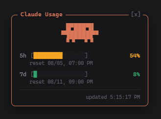
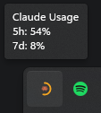
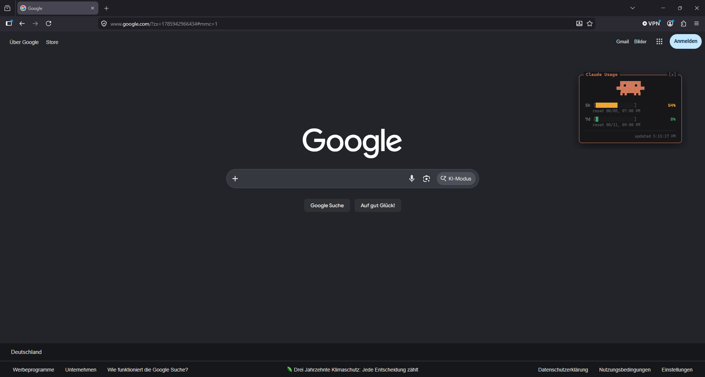

# Usage Tray Tool for Claude




A free, open-source Windows and macOS tool that shows your current
Claude.ai / Claude Code usage (5-hour and 7-day windows, Pro/Max
subscription) right on your desktop. It lives as an icon in the system
tray / menu bar and, on click, opens a small always-on-top widget with the
detailed usage breakdown.

> **Disclaimer:** This is an independent, unofficial hobby project. It is
> **not affiliated with, endorsed by, or supported by Anthropic** in any
> way. "Claude" and "Anthropic" are trademarks of Anthropic, PBC — used
> here only to describe compatibility. The app relies on an
> **undocumented, internal Anthropic endpoint** that is not a public API,
> may change or break at any time without notice, and could stop working
> or violate Anthropic's terms of service in the future. Use at your own
> risk — provided "as is", with no warranty of any kind. This tool does
> not send your data anywhere except directly to Anthropic's own API using
> your own existing credentials; nothing is collected, logged, or shared
> by the project itself.

## Installation

Grab the latest build from [GitHub Releases](https://github.com/paulkoepke/claude-usage-tray-tool/releases/latest).

### Windows

- **Installer** (`...Setup*.exe`) — installs the app and adds it to your
  Start menu, with an uninstaller.
- **Portable** (`...portable.exe`) — a single, standalone exe. No
  installation, just download and run.

Windows SmartScreen may warn about the app since it isn't code-signed
with a paid certificate — click "More info" → "Run anyway" to launch it.

### macOS

- **`.dmg`** — mount it and drag the app into `/Applications`.
- **`.zip`** — unzip and move the app into `/Applications` yourself.

The app is **not notarized** — it's ad-hoc signed but has no paid Apple
Developer Program membership behind it (this is a free hobby project), so
there's no verifiable developer identity for Gatekeeper to trust. Because
of that, macOS will refuse to open a downloaded copy with a plain
double-click — usually with **"...is damaged and can't be opened. You
should move it to the Trash."** On current macOS versions, right-click →
"Open" does **not** bypass this (that trick only works for apps signed
with a real paid Developer ID). To launch it the first time, use one of:

- **Terminal (fastest, always works):** remove the quarantine flag that
  macOS attaches to downloaded files:
  `xattr -cr "/Applications/Usage Tray Tool for Claude.app"`
  (adjust the path if you haven't moved it into `/Applications` yet), then
  open it normally.
- **System Settings:** try to open the app once (it will fail/warn) →
  **System Settings → Privacy & Security** → scroll to the bottom → click
  **"Open Anyway"** next to the notice about the blocked app → confirm
  in the follow-up dialog.

Either way, this only has to be done once per copy of the app — after
that it launches normally.

**Auto-update is notify-only on macOS**, not automatic. Since the app
isn't signed, `electron-updater`'s update mechanism can't verify and
install a downloaded update the way it does on Windows. Instead, the app
checks GitHub Releases in the background and — if a newer version exists —
shows a "New version available!" item in the tray's right-click menu that
opens the releases page, same as the Windows portable build. Download and
reinstall (drag the new `.app` over the old one) to update.

## Features

- **Tray icon**: shows usage as a ring/bar (32x32), color-coded by
  threshold — green (<50%), yellow (50–80%), red (>80%)
- **Popup window**: click the tray icon to open a frameless, draggable
  window with two progress bars (5h / 7d), percentage, and reset time
- **Context menu** (right-click): "Refresh now", "Show/Hide", "Start with
  Windows" / "Start with macOS" (login item toggle), "Quit"
- Polls usage data automatically every 180 seconds
- **Auto-updates** (Windows installer version only): checks GitHub
  Releases on startup, downloads updates in the background, and installs
  them on the next restart — no manual re-download needed. The Windows
  portable exe and the **macOS build** don't auto-install updates, but
  show a "New version available!" item in the tray's right-click menu —
  click it to open the releases page. See [macOS](#macos) above for why.

### Autostart ("Start with Windows" / "Start with macOS")

The tray menu's login-item toggle uses Electron's
`app.setLoginItemSettings()` on both platforms — on macOS this registers
the app with the standard macOS Login Items list (same one under System
Settings → General → Login Items). It works the same whether the app is
signed or not; unsigned code signing doesn't block registering as a login
item. Note that macOS Login Items are registered by the app's file path,
so if you replace the `.app` bundle with a new version at a different
location, you may need to re-toggle autostart off/on once.

## Tech stack

- Electron (TypeScript), scaffolded with `electron-vite`
- `@napi-rs/canvas` — renders the tray icon in the main process
- Renderer: vanilla TypeScript (no framework), talks to the main process
  via `contextBridge` / IPC

**Why Electron for a tray icon?** Yes, it's overkill — a hundred MB of RAM and
a Chromium process for something that could be a native tray app. It's
not the lightest choice, but it was the most fun for me to build, and it’s just a hobby project.

## Data source

The app calls an **undocumented, internal Anthropic endpoint** (not an
official public API):

```
GET https://api.anthropic.com/api/oauth/usage
Authorization: Bearer <accessToken>
anthropic-beta: oauth-2025-04-20
```

The `accessToken` is reused from your existing local Claude Code login —
no separate sign-in required. On Windows it is stored in plaintext at
`%USERPROFILE%\.claude\.credentials.json`. On macOS it is stored in the
Keychain instead, under the service name `Claude Code-credentials` — the
app reads it via `security find-generic-password -s "Claude
Code-credentials" -w`. Either way, this app only reads the token locally
on your machine.

## Project structure

```
src/
  main/       # Electron main process (tray, icon rendering, token, polling)
  preload/    # contextBridge / IPC bridge to the renderer
  renderer/   # popup UI (vanilla TS, HTML, CSS)
  shared/     # shared types
resources/    # tray mascot (256x256 PNG)
build/        # app icon for installer/exe (1024x1024 PNG)
```

## Development

```bash
npm install
npm run dev         # electron-vite dev mode
npm run typecheck   # TypeScript checks (main + renderer)
npm run build       # production build
npm run dist:win    # Windows installer (NSIS) via electron-builder
npm run dist:mac    # macOS .dmg + .zip via electron-builder (unsigned)
```

## Screenshots

**Popup widget**


**On the desktop**



**Tray icon & tooltip**


## License

MIT — see [LICENSE](LICENSE).
